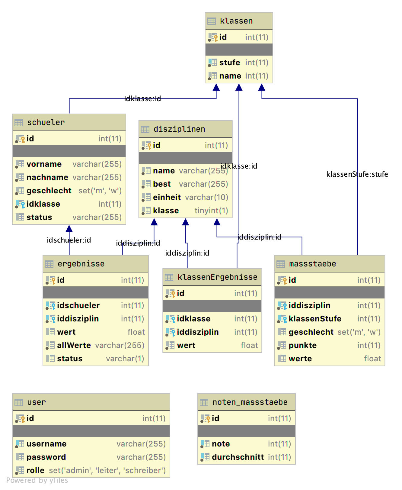

# Sportfest Backend
Here you can find the backend code for the evaluation system of the sports festival at the Giebichenstein-Gymnasium "Thomas Müntzer".

## Database model
The database will initalize itself on the first run.

## GraphQL shema
You can find the graphlql API shema [here](schema.graphql).
